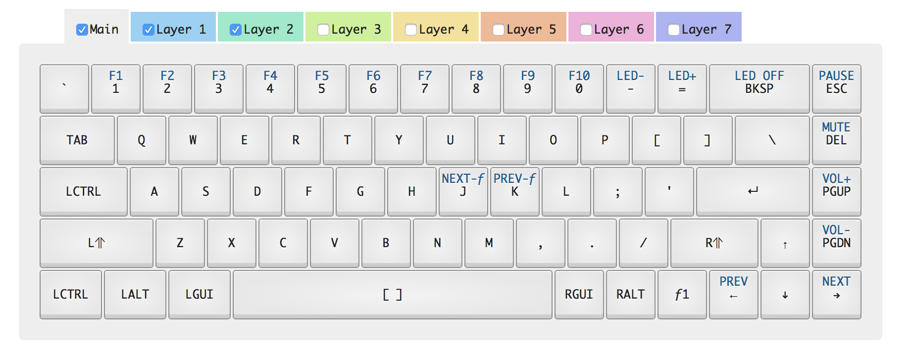

# Whitefox (VanillaBlank) Layout for macOS

A layout for the [WhiteFox](https://input.club/whitefox/) (VanillaBlank v1.1) 
keyboard that moves a few keys to feel more like a standard Mac keyboard.  
This includes the left and right special key arrays.  Additionally, `CAPSLOCK` is replaced
with `CONTROL` to make text editing with Vim and Emacs more enjoyable.

# Flashing Firmware

1. Obtain the USB flashing utility: `brew install dfu-util`
1. Insert slim object into small hole on the back of the keyboard.  The
   top key LEDs should turn off and a faint orange LED should emit from
   the hole.
1. Load the firmware onto the keyboard: `dfu-util -D kiibohd.dfu.bin`
