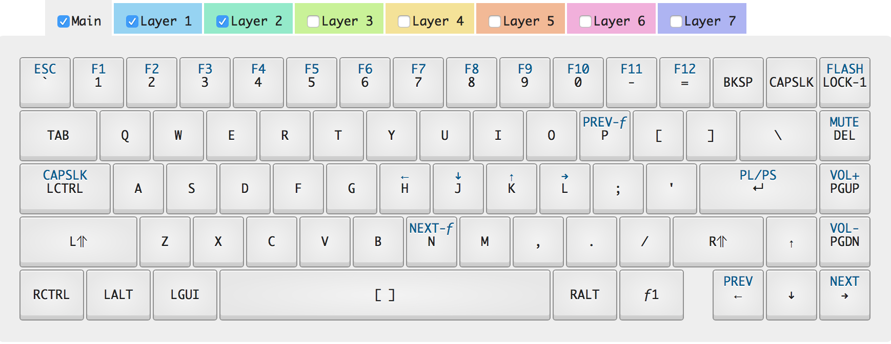

# WhiteFox / NightFox (TrueFox) Layout for macOS

A layout for the
[NightFox](https://kono.store/products/nightfox-mechanical-keyboard) keyboard
that moves a few keys to feel more like a standard Mac keyboard.

# Layout

# Flashing Firmware

[Firmware flashing instructions](https://github.com/kiibohd/controller/blob/master/Documentation/Keyboards/WhiteFox.md#flashing-the-whitefox)
